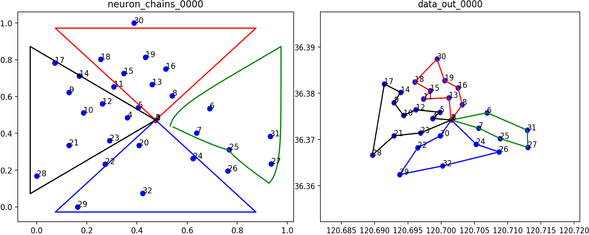
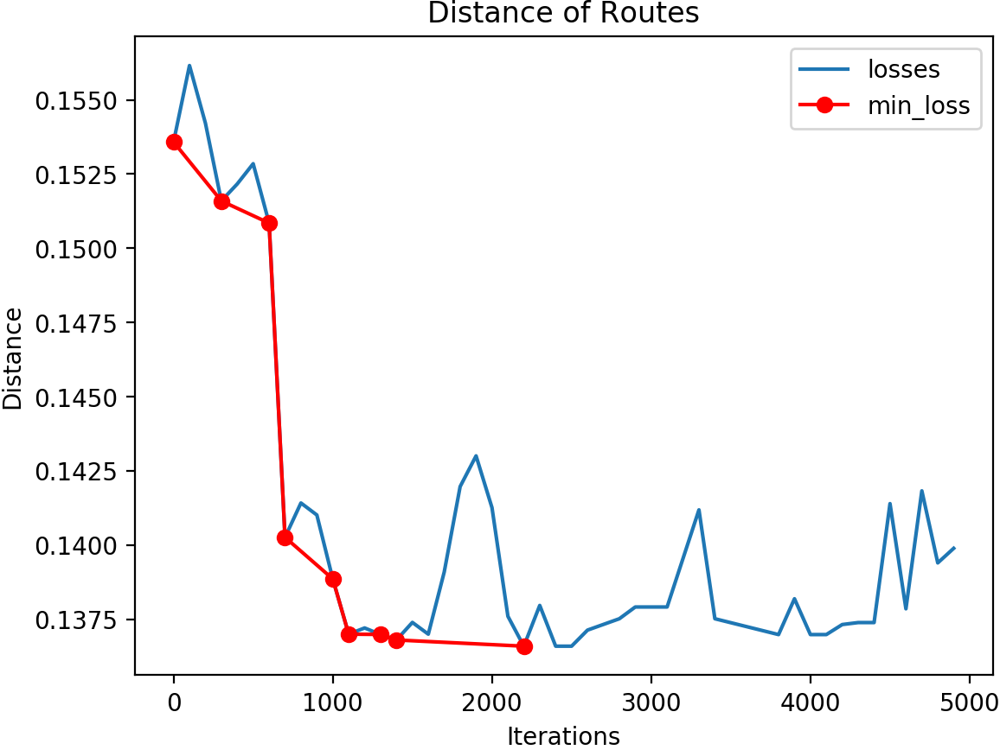

# som-mTSP
self-organizing map for multiple traveling salesman problem


# 1.Requirements:

```
matplotlib
argparse
path
pandas
tqdm
json
numpy
```

# 2.Run

Edit [src/opts.py](src/opts.py) for args setting and excute:

```bash
python src/main.py
```


# 3.Results





# M2CT2020

程序执行后生成 out_dir文件夹， 在运行后会生成npy文件和csv文件， 此类文件通过src/plot的函数作图得到可视化结果.